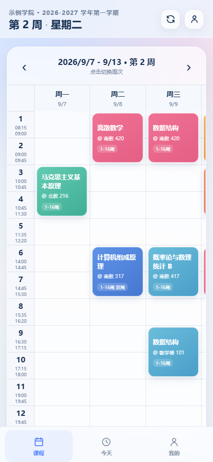

# 广金课表 PWA

面向广东金融学院学生的手机网页课程表。它不是微信小程序，直接用浏览器打开即可；支持添加到手机桌面、离线查看，并通过学校强智教务系统导入课程。



## 已实现

- 手机优先的周课表，横向滑动查看 7 天
- 当前周、前后周切换、今天定位
- 广东金融学院强智教务登录导入
- 课程名称、教师、教室、周次和节次展示
- 课表与个人信息保存在本机浏览器
- PWA 离线壳，可添加到主屏幕
- 无广告、无第三方统计分析

## 本地运行

需要 Node.js 20 或更高版本，项目没有第三方 npm 依赖。

```powershell
node server.mjs
```

浏览器打开：

```text
http://localhost:4173
```

手机上访问时，让手机和电脑连接到同一 Wi-Fi，然后使用电脑的局域网 IP，例如：

```text
http://192.168.1.10:4173
```

## 工作方式

1. 页面把学号和密码通过 HTTPS `POST /api/session` 提交到本项目自己的 Node 代理。
2. 代理调用 `https://jwxt.gduf.edu.cn/app.do?method=authUser` 换取短时 Token。
3. 代理使用 Token 获取当前周和课表，再把规范化后的课程返回浏览器。
4. 浏览器只保存课表数据，不保存密码；Token 只在当前浏览器标签会话中保存，并且只通过请求体发送。

服务端不会把学号、密码写入文件或数据库，也不会输出到日志。请求说明参考公开的 [GDUF-QZAPI](https://github.com/EwingYangs/GDUF-QZAPI) 文档。

## 部署建议

这个项目需要 Node 进程转发学校接口，不能只把 `public/` 放到纯静态托管上。可以部署到支持 Node.js 的平台，例如 Render、Railway、Fly.io 或自己的服务器。

公网部署必须配置 HTTPS。不要在不受信任的第三方网站上输入学校账号密码。

启动命令：

```text
node server.mjs
```

平台通常会通过 `PORT` 环境变量指定端口，本项目会自动读取。

## 接口说明

### `POST /api/session`

请求：

```json
{
  "studentId": "学号",
  "password": "教务系统密码"
}
```

返回 Token、学生信息、当前周和该周课程。

### `POST /api/timetable`

请求体：

```json
{
  "studentId": "学号",
  "token": "短时 Token",
  "week": 2,
  "termId": "学期 ID"
}
```

用于登录后切换周次，Token 不放在 URL 中。

## 注意事项

- 学校接口是移动端旧接口，未来可能变更。如果导入失败，需要根据当时教务系统页面重新验证接口。
- 本项目只适配广东金融学院强智教务，不适用于正方、URP 等其他系统。
- 公开部署和分享前，请先确认学校对自动化访问的要求，并控制请求频率。
- 本项目与广东金融学院及强智科技没有隶属关系。
